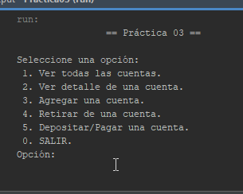

# Practica_03-Manejador_de_Cuentas_bancarias

<div>
    <br/>
    <p align="center">
        <a href="#" target="_blank">
            
        </a>
    </p>
    <br>
    <div>
        <p align="center">
        Manejador de <a href="#" >Cuentas</a> Bancarias
        </p>
    </div>
    <div>
        <p align="center">
            <a href="#" target="_blank">Java</a> | <a href="#" target="_blank">C++</a> | <a href="#" target="_blank">JavaScript</a>
        </p>
    </div>
</div>

## Funciones
- Agregar Cuentas bancarias
- Retirar Dinero
- Depocitar Dinero
- Pago de credito
- ver cuentas
- Detallar cuenta



## Instalacion

#### Paso 1:
```

```

#### Paso 2:
```

```
#### Paso 3:
```

```
#### Paso 4:
```

```

## Uso

## API

## Acerca de:
Este proyecto es realizado por [LUIS ROBERTO FLORES DE LA FUENTE]() y fue escrito por [Luis Gerardo](https://github.com/GitLuisG)